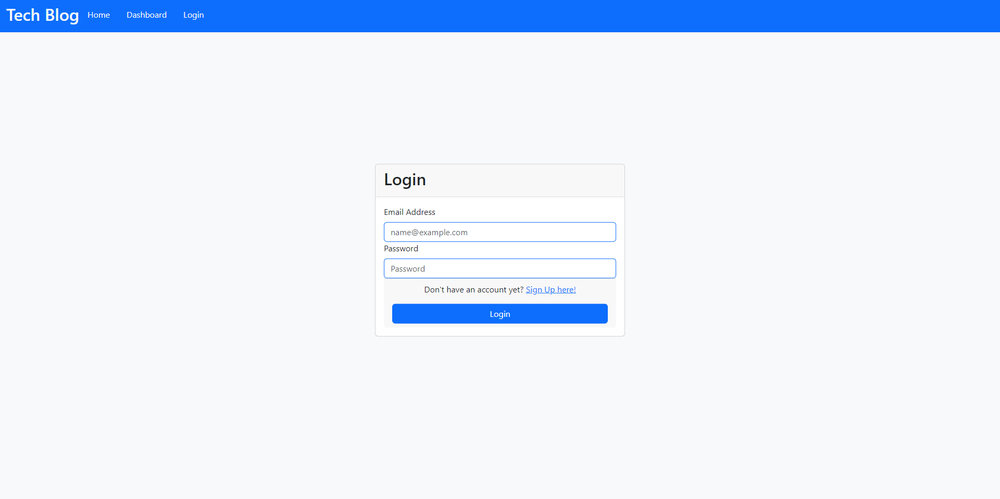
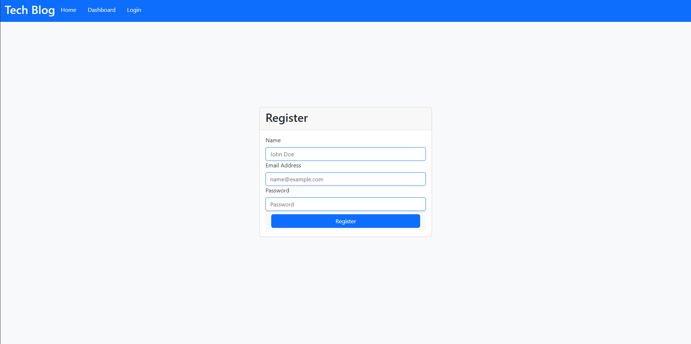
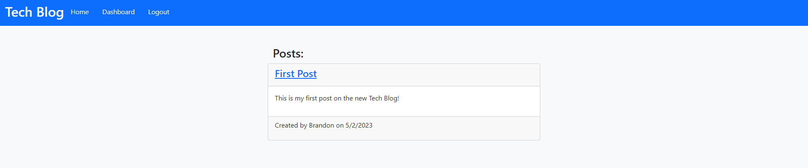
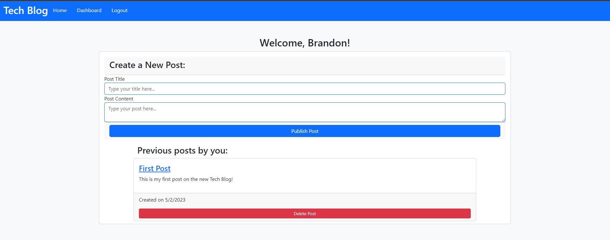
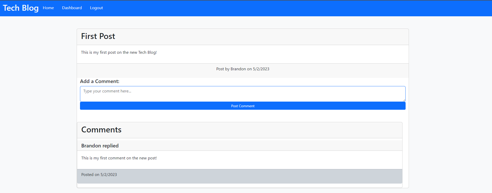

# Tech Blog

## Description 
This project is a CMS Styled Tech Blog. You will have the ability to register, login, post threads, and comment on threads. It is built using Sequelize, Express, Handlebars, Bootstrap, and vanilla JavaScript.

## Table of Contents

* [Installation](#installation)
* [Packages](#packages)
* [Preview](#preview)
* [Deployment](#deployment)

## Installation

To install necessary dependencies, run the following commands (assuming you are on git bash and already have node.js/nodemon installed):
  
``` 
Run npm i
```   
``` 
Execute the schema located in the db folder if ran on a local machine
```
```
Run npm start to initialize your server
```

## Packages 
- mysql2
- sequelize
- connect-session-sequelize
- express-handlebars
- express-session
- express
- dotenv
- bcrypt

## Preview







## Deployment
 Deployed Application using Heroku

[Click Here to view the deployed application](https://serene-tor-17633.herokuapp.com/login) 
